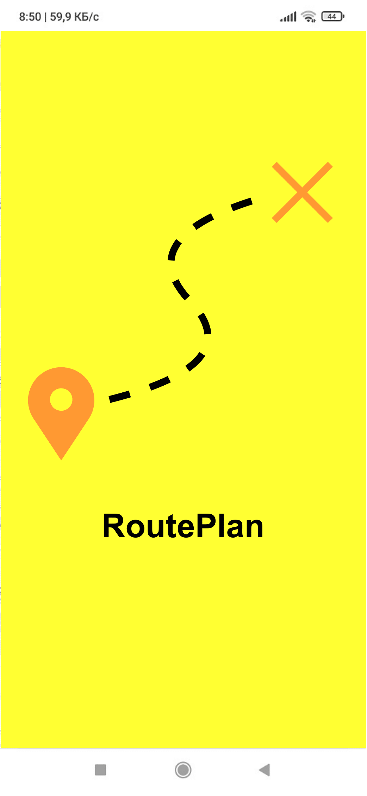
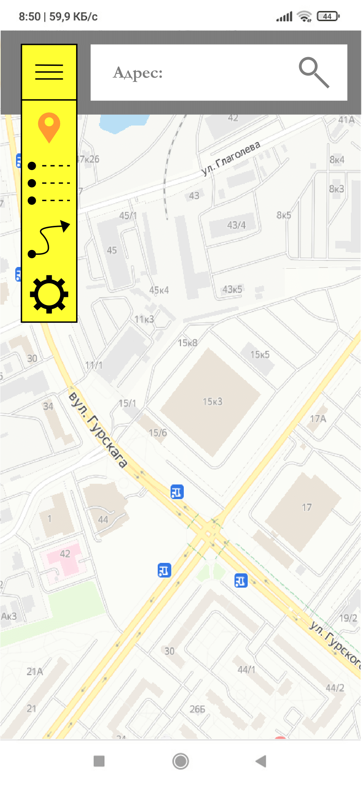
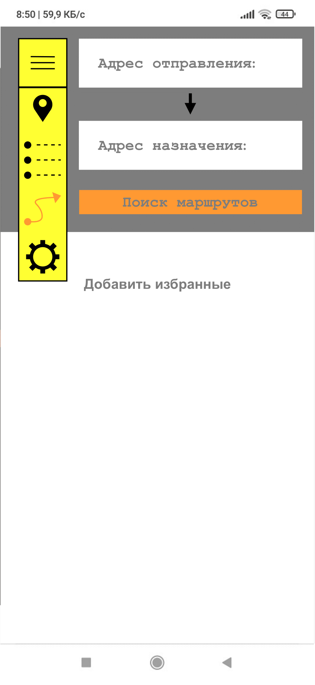

# Требования к проекту
---

# Содержание
1 [Введение](#intro)  
1.1 [Назначение](#appointment)  
1.2 [Бизнес-требования](#business_requirements)  
1.2.1 [Исходные данные](#initial_data)  
1.2.2 [Возможности бизнеса](#business_opportunities)  
1.2.3 [Границы проекта](#project_boundary)  
1.3 [Аналоги](#analogues)  
1.4 [Отличия от аналогов](#differences_from_analogues)  
2 [Требования пользователя](#user_requirements)  
2.1 [Программные интерфейсы](#software_interfaces)  
2.2 [Интерфейс пользователя](#user_interface)  
2.3 [Характеристики пользователей](#user_specifications)  
2.3.1 [Классы пользователей](#user_classes)  
2.3.2 [Аудитория приложения](#application_audience)  
2.3.2.1 [Целевая аудитория](#target_audience)   
2.4 [Предположения и зависимости](#assumptions_and_dependencies)  
3 [Системные требования](#system_requirements)  
3.1 [Функциональные требования](#functional_requirements)  
3.1.1 [Основные функции](#main_functions)  
3.1.1.1 [Прокладывание маршрута](#route_planning)  
3.1.1.2 [Навигация на карте](#navigation_on_map)  
3.1.1.3 [Просмотр расписания](#view_timetable)  
3.1.1.4 [Настройки](#settings)    
3.1.2 [Ограничения и исключения](#restrictions_and_exclusions)  
3.2 [Нефункциональные требования](#non-functional_requirements)  
3.2.1 [Атрибуты качества](#quality_attributes)  
3.2.1.1 [Требования к удобству использования](#requirements_for_ease_of_use)  
3.2.1.2 [Требования к безопасности](#security_requirements)  
3.2.2 [Внешние интерфейсы](#external_interfaces)  
3.2.3 [Ограничения](#restrictions)  

<a name="intro"/>

# 1 Введение

<a name="appointment"/>

## 1.1 Назначение
В этом документе описаны функциональные и нефункциональные требования к приложению Приложение для планирования поездок на общественном транспорте "RoutePlan". Этот документ предназначен для команды, которая будет реализовывать и проверять корректность работы приложения. 

<a name="business_requirements"/>

## 1.2 Бизнес-требования

<a name="initial_data"/>

### 1.2.1 Исходные данные
Большая часть населения Рб не обладает личным транспортом по тем или иным причинам. В тоже время в нашей стране достаточно развит общественный транспорт, но не все люди могут уверенно ориентироваться в маршрутах следования этого транспорта, особенно в случае с молодежью. Для больших городов, таких как Минск, проблема особенно актуальна для всех слоев населения, так как количество маршрутов в столице очень большое и даже человек, который всю жизнь живет в Минке, скорее всего не будет знать все имеющиеся маршруты. Для помощи перемещения по городу на общественном транспорте и будет использоваться приложение "RoutePlan". Оно позволит быстро найти наиболее быстрый и удобный маршрут перемещения между любыми точками города с использованием всех имеющихся видов транспорта.

<a name="business_opportunities"/>

### 1.2.2 Возможности бизнеса
Данное приложение будет очень актуально для людей любых возрастных категорий, которые часто перемещаются по городу на общественном транспорте в места, которые раньше им посещать не приходилось. Возможно, некоторым людям может понадобиться проложить оптимальный маршрут для выполнения работы. У некоторых пользователей может возникнуть ситуация, когда они не попали на транспорт, на котором они привыкли ездить. Приложение "RoutePlan" поможет выйти из тяжелой ситуации и приехать в место назначения вовремя. 

<a name="project_boundary"/>

### 1.2.3 Границы проекта
Приложение «RoutePlan» предоставляет всем категориям пользователей возможности ориентироваться на карте города, с использованием данных местоположения телефона, просматривать актуальное расписание движения общественного транспорта и находить различные маршруты следования из одного места в другое, с учетом пожеланий пользователя на предмет того, какой вид транспорта он больше предпочитает.

<a name="analogues"/>

## 1.3 Аналоги
Moovit — бесплатным мобильным приложением GPS для получения информации об общественном транспорте и навигации, разработанным израильским стартапом Tranzmate.

Transit — мобильное приложение, предоставляющее данные об общественном транспорте в режиме реального времени.

Яндекс Карты — мобильное приложение, позволяющее производить поиск по карте, информация о пробках, отслеживание городского транспорта, прокладка маршрутов и панорамы улиц крупных и других городов.

<a name="differences_from_analogues"/>

## 1.4 Отличия от аналогов
В отличие от приложения "Moovit", в разрабатываемом приложение будет возможность ориентироваться по встроенной карте, а не только выбирать на ней адреса, между которыми происходит движение. С сервисом Яндекса тяжело соперничать, так как он предлагает намного более широкий набор возможностей.

<a name="user_requirements"/>

# 2 Требования пользователя

<a name="software_interfaces"/>

## 2.1 Программные интерфейсы
Язык программирования, выбранный для разработки, — Kotlin. Разрабатываться приложение будет с использованием фреймворка Android studio. База данных — SQLite. Android SDK - инструменты, необходимые для разработки. Для использования карты, будет интегрирован сервис — OpenStreetMap.

<a name="user_interface"/>

## 2.2 Интерфейс пользователя
При запуске приложения, пользователя будет приветствовать загрузочный экран с логотипом.

Просмотр карты осуществляется во вкладке навигации.

Просмотр расписания общественного транспорта осуществляется во вкладке расписания.

Поиск маршрутов осуществляется во вкладке маршрутов.

<a name="user_specifications"/>

## 2.3 Характеристики пользователей

<a name="user_classes"/>

### 2.3.1 Классы пользователей

| Класс пользователей | Описание |
|:---|:---|
| Пользователи с подпиской | Имеют доступ ко всем возможностям приложения. Избавлен от необходимости регулярно просматривать рекламные интеграции. Авторизация пользователей будет происходить через сервис Google Play. |
| Пользователи без подписки | Имеют доступ ко всем возможностям приложения. |

<a name="application_audience"/>

### 2.3.2 Аудитория приложения

<a name="target_audience"/>

#### 2.3.2.1 Целевая аудитория
Люди всех возрастных категорий, имеющие необходимость регулярно пользоваться общественным транспортом, обладающие минимальной технической грамотностью.

<a name="assumptions_and_dependencies"/>

## 2.4 Предположения и зависимости
1. Приложение не работает при отсутствии подключения к Интернету;
2. Приложение не сможет предоставить возможности навигации и прокладывания маршрутов без доступа к данным навигации смартфона.

<a name="system_requirements"/>

# 3 Системные требования

<a name="functional_requirements"/>

## 3.1 Функциональные требования

<a name="main_functions"/>

### 3.1.1 Основные функции

<a name="route_planning"/>

#### 3.1.1.1 Прокладывание маршрута
**Описание.** Пользователь имеет возможность прокладывать маршрут, с использованием различного общественного транспорта, из одного места в другое.

| Функция | Требования | 
|:---|:---|
| Найти маршрут | Прокладывать несколько маршрутов. Предоставить возможность выбрать предпочитаемый вид транспорта. При необходимости сохранить маршрут. Показывать на маршрутах время движения тем или иным образом (пешком, на автобусе и т.д.). Указать при необходимости, что движение по маршруту начнется не сразу, а спустя некоторое время, чтобы верно подобрать транспорт, основываясь на его времени прибытия |
| Выбор начального и конечного адреса | Возможность выбора конечного и начального пункта движения как на карте, так и в письменном формате. Сохранять при необходимости адрес |
| Движение по выбранному маршруту | Приложение будет в реальном времени следить за движением пользователя по маршруту. Ориентировать пользователя на протяжении всего движения по выбранному маршруту (напоминать об выходе на остановках). Функция должна работать в фоновом режиме. При необходимости пользователь может закончить отслеживание движения по маршруту раньше времени |

<a name="navigation_on_map"/>

#### 3.1.1.2 Навигация на карте
**Описание.** Пользователь будет иметь возможность ориентироваться на карте с использованием данных о местоположении телефона. На карте будут отображаться остановки общественного транспорта.
 
| Функция | Требования | 
|:---|:---|
| Просмотреть информацию об остановке | Показать пользователю информацию об времени прибытия общественного транспорта на данной остановке. Показывать на карте движения ближайшего транспорта |
| Поиск | Пользователь может найти по названию на карте необходимое место |

<a name="view_timetable"/>

#### 3.1.1.3 Просмотр расписания
**Описание.** Пользователь может просматривать актуальное расписание общественного транспорта.

| Функция | Требования | 
|:---|:---|
| Просмотреть информацию об маршруте | Пользователь может открыть информацию об нужном номере маршрута и посмотреть его путь и время прибытия на остановки. При необходимости можно добавить номер транспорта в избранное |
| Поиск маршрута | Пользователь может ввести номер и по нему найти необходимый маршрут |
| Выбрать нужный вид транспорта | Пользователь может перемещаться по категориям в зависимости от нужного вида транспорта. Для избранного будет отдельная категория |
| Уведомлять пользователя при изменениях в расписании | Пользователь будет получать информацию об изменениях в расписании. Если изменения повлияют на сохраненные маршруты, отдельно уведомить об этом |

<a name="settings"/>

#### 3.1.1.4 Настройки
**Описание.** Пользователь может настроить приложение в соответствующей вкладке.

| Функция | Требования | 
|:---|:---|
| Оплата подписки | Пользователь имеет возможность оплатить подписку, чтобы поддержать разработчика и отключить рекламу |
| Изменение цветовой схемы приложения | Пользователь имеет возможность поменять цветовую палитру пользовательского интерфейса на более приятную для него |
| Уведомления | Отключение или включение всплывающих уведомлений об изменениях в расписании общественного транспорта |

<a name="restrictions_and_exclusions"/>

### 3.1.2 Ограничения и исключения
1. Приложение работает только при наличии подключения к Интернету;
2. При отсутствии доступа к данным местоположения телефона, пользователь сможет просматривать только расписание общественного транспорта. 

<a name="non-functional_requirements"/>

## 3.2 Нефункциональные требования

<a name="quality_attributes"/>

### 3.2.1 Атрибуты качества

<a name="requirements_for_ease_of_use"/>

#### 3.2.1.1 Требования к удобству использования
1. Доступ к основным функциям приложения не более чем за две операции;
2. Все функциональные элементы пользовательского интерфейса имеют названия, описывающие действие, которое произойдет при выборе элемента;
3. Возможность сохранения часто используемых маршрутов;
4. Возможность сохранения часто используемых номеров транспорта.

<a name="security_requirements"/>

#### 3.2.1.2 Требования к безопасности
Приложение не собирает личную информацию об пользователе, кроме возможности задания домашнего адреса. Однако иной информации о пользователе не будет, поэтому соотнести ее с конкретным человеком нельзя. Оплата подписки производиться через надежный сервис Google Play.
 
<a name="external_interfaces"/>

### 3.2.2 Внешние интерфейсы
Все иконки в приложении минималистичны и не нагружают зрение. Сам пользовательский интерфейс в общем не перегружен и интуитивно понятен. Есть возможность выбора приятной для глаз цветовой палитры. 

<a name="restrictions"/>

### 3.2.3 Ограничения
1. Приложение требует подключение к интернету;
2. Для прокладывания маршрута и навигации на карте необходим доступ к данным местоположения;
3. Составление маршрутов происходит на сервере и возможны задержки перед их получением;
4. Актуальная информация об общественном транспорте для некоторых городов, необходимая для работы приложения, может отсутствовать в открытых источниках.
